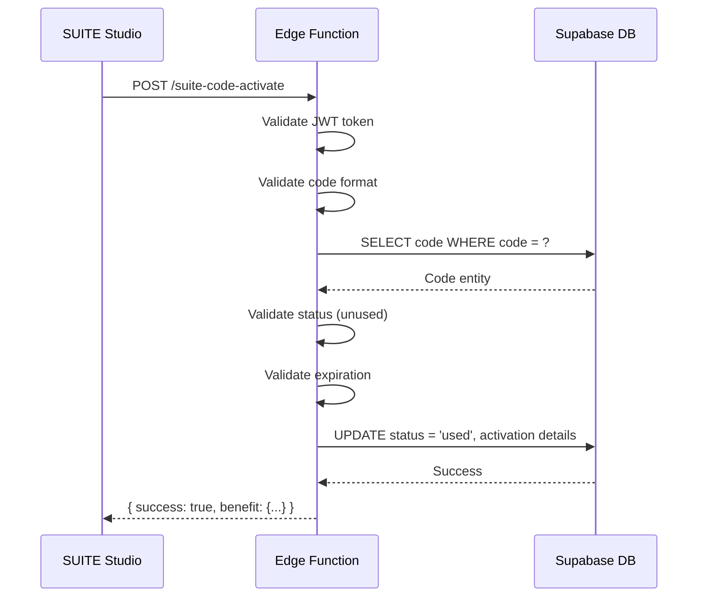

# Suite Code Activation Edge Function

Supabase Edge Function for SUITE Studio activation code validation and activation.

## Overview

This Edge Function handles client-side activation requests from the SUITE Studio application. It validates activation codes and records activation details including IP address, device information, and timestamp.

## Requirements Implemented

- **5.1**: Verify code exists and is in unused status
- **5.2**: Verify code has not expired
- **5.3**: Apply corresponding benefit (membership or credits) to user account
- **5.4**: Record activation details (IP, device, timestamp, user)
- **5.5**: Return appropriate error messages for invalid codes

## API Endpoint

```
POST /functions/v1/suite-code-activate
```

### Request Headers

| Header | Required | Description |
|--------|----------|-------------|
| `Authorization` | Yes | Bearer token for user authentication |
| `Content-Type` | Yes | Must be `application/json` |

### Request Body

```json
{
  "code": "SULTRA-XXXX-XXXX",
  "device_info": "Windows 11, Chrome 120"
}
```

| Field | Type | Required | Description |
|-------|------|----------|-------------|
| `code` | string | Yes | The activation code to validate |
| `device_info` | string | No | Device/browser information |

### Success Response (200)

```json
{
  "success": true,
  "message": "成功激活 ULTRA 会员 30 天",
  "benefit": {
    "type": "membership",
    "membership_tier": "ultra",
    "membership_days": 30
  }
}
```

For credits codes:

```json
{
  "success": true,
  "message": "成功充值 500 积分",
  "benefit": {
    "type": "credits",
    "credits_amount": 500
  }
}
```

### Error Response (400/401/500)

```json
{
  "success": false,
  "message": "激活码已被使用",
  "error": {
    "code": "CODE_ALREADY_USED",
    "message": "激活码已被使用"
  }
}
```

### Error Codes

| Code | HTTP Status | Description |
|------|-------------|-------------|
| `CODE_NOT_FOUND` | 400 | Activation code does not exist |
| `CODE_ALREADY_USED` | 400 | Code has already been activated |
| `CODE_EXPIRED` | 400 | Code has passed its expiration date |
| `CODE_DISABLED` | 400 | Code has been disabled by admin |
| `INVALID_FORMAT` | 400 | Code format is invalid |
| `MISSING_CODE` | 400 | No code provided in request |
| `UNAUTHORIZED` | 401 | User not authenticated |
| `ACTIVATION_FAILED` | 500 | Server error during activation |

## Deployment

```bash
# Deploy the function
supabase functions deploy suite-code-activate

# Set environment variables (if not already set)
supabase secrets set SUPABASE_URL=your_supabase_url
supabase secrets set SUPABASE_SERVICE_ROLE_KEY=your_service_role_key
```

## Testing

### Using cURL

```bash
# Test activation
curl -X POST \
  'https://your-project.supabase.co/functions/v1/suite-code-activate' \
  -H 'Authorization: Bearer YOUR_USER_JWT_TOKEN' \
  -H 'Content-Type: application/json' \
  -d '{"code": "SULTRA-XXXX-XXXX", "device_info": "Test Device"}'
```

### Using JavaScript

```javascript
const { data, error } = await supabase.functions.invoke('suite-code-activate', {
  body: {
    code: 'SULTRA-XXXX-XXXX',
    device_info: navigator.userAgent
  }
});

if (data.success) {
  console.log('Activation successful:', data.benefit);
} else {
  console.error('Activation failed:', data.error);
}
```

## Activation Flow



## Security Considerations

1. **Authentication Required**: All activation requests require a valid JWT token
2. **Race Condition Prevention**: Uses optimistic locking with status check in UPDATE
3. **IP Logging**: Records client IP for audit purposes
4. **Service Role Key**: Uses service role for database operations (bypasses RLS)

## Related Files

- `supabase/migrations/017_create_suite_codes_table.sql` - Database schema
- `dash/src/lib/suite-code/validator.ts` - Validation logic (admin dashboard)
- `dash/src/lib/supabase/suite-code-types.ts` - Type definitions
